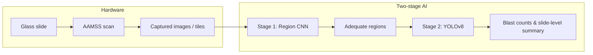

# ALLocate

**An AI-powered self-driving microscope for low-cost acute leukemia detection**

[](https://www.python.org/)
[](https://creativecommons.org/licenses/by-nc/4.0/)

> ALLocate (**Acute Leukemia Locate**) couples a low-cost motorized microscope stage with a **two-stage** deep learning pipeline: a **CNN region classifier** (adequate vs. blood vs. clot) and a **YOLOv8** blast / non-blast detector. This repository will hold code, notebooks, hardware notes, and release artifacts for the accompanying manuscript.

---

## At a glance

| Component | Role |
|-----------|------|
| **AAMSS** (hardware) | Automated capture of marrow smears on a conventional microscope (~\$150 parts; not including microscope) |
| **Stage 1 — Region model** | Selects diagnostically adequate tiles before cell-level analysis |
| **Stage 2 — Detection model** | Localizes nucleated cells and classifies blasts vs. non-blasts |
| **End-to-end** | Tile → regions → detections → slide-level blast fraction vs. clinical thresholds |



---

## Repository layout *(skeleton — organize as code lands)*

```
ALLocate/
├── README.md                 ← you are here
├── region_classifier/      ← Stage 1: data prep, training, evaluation, inference
├── cell_detection/         ← Stage 2: data prep, training, evaluation, inference
├── pipeline/               ← `allocate_ai_pipeline.py`: capture → region → detect → report
├── data/                   ← Data layout placeholders (no patient data in git)
├── notebooks/              ← Figure / plot reproduction for the paper
├── examples/               ← A small set of example images for documentation
├── weights/                ← Model checkpoints (release policy TBD)
```

---

## Installation


```bash
# Placeholder — replace with real instructions
python -m venv .venv
source .venv/bin/activate  # Windows: .venv\Scripts\activate
pip install -r requirements.txt
```


---

## Data & cohorts *(high level)*

Training used de-identified whole-slide and tiled data from **UCSF**; external testing included **MSKCC** digitized slides and **glass-slide** evaluation via the self-driving microscope (**SDM**). 

Purpose *(paper)* | Notes for this repo |
|-------------------|---------------------|
Region classifier train / eval | Placeholder manifests under `region_classifier/` |
Cell detector train / eval | Bounding-box format TBD in `cell_classifer/`

**TODO:** Add `data/availbility_statement.md` with directory conventions, filename patterns, and ethics / access language approved by the team.

---

## Stage 1 — Region classifier (CNN)

### Data format

On-disk layout follows **ImageNet-style** image folders (class = subdirectory name):

```
<dataset_root>/
├── train/
│   ├── adequate/
│   │   ├── <image>.png
│   │   └── ...
│   ├── blood/
│   └── clot/
└── test/
    ├── adequate/
    ├── blood/
    └── clot/
```

- Source tiles are 40× / 400×-equivalent WSI-derived patches; class names are **`adequate`**, **`blood`**, **`clot`**.
- Use **`train/`** for training and **`test/`** for held-out evaluation (add **`val/`** if you use a separate validation split).

### Training

- Framework: TensorFlow *(per manuscript)*; augmentations via Albumentations.
- Entry point: **`region_classifier/train.py`** *(stub — Ethan to implement)*.

### Evaluation

- Entry point: **`region_classifier/eval.py`** *(stub — Ethan to implement)*.


---

## Stage 2 — Cell detection (YOLOv8)

### Data format (Roboflow → YOLO)

Labels for this project were collected in **[Roboflow](https://roboflow.com/)** (private workspace / project).

- **Project type:** **Object detection** — each instance is a **bounding box** (axis-aligned rectangle).  
  Roboflow also supports **instance segmentation** (polygon / “press P” vertex tools); **that workflow is not what we used** for ALLocate’s cell detector—stick to **bounding-box** detection labels for blast vs. non-blast (+ **artifact** during training to suppress false positives).
- **Typical Roboflow flow:** create a workspace → **Upload** images → assign / open **Unannotated** images → draw boxes per class → **Generate** a version (with any augmentations in Roboflow) → **Export** in **YOLOv8** format (YOLOv5-compatible layout is fine for Ultralytics).

After export, the dataset on disk usually matches this shape (names may be `valid` vs `val` depending on export):

```
<dataset_root>/
├── data.yaml              # train/val paths, nc, names
├── train/
│   ├── images/            # .jpg / .png
│   └── labels/            # one .txt per image, YOLO format
├── valid/                 # or val/
│   ├── images/
│   └── labels/
└── test/                  # optional
    ├── images/
    └── labels/
```

**YOLO label files** (`.txt`): one line per box — `class_id x_center y_center width height` with coordinates **normalized** to `[0, 1]` relative to image width/height. **`data.yaml`** lists `train` / `val` (paths or relative dirs), `nc`, and `names` (class names in order of class id).

### Training

- **Ultralytics YOLOv8**; hyperparameter choices are summarized in the paper’s supplementary tables.
- Entry point: **`cell_detection/train.py`** *(stub — Ethan to implement; typically wraps `yolo train` or the Ultralytics API with a path to `data.yaml`)*.

### Evaluation

- Entry point: **`cell_detection/eval.py`** *(stub — Ethan to implement; validation mAP / PR, etc.)*.


---

## End-to-end pipeline

The full system chains **(i)** image acquisition with the **AAMSS** hardware, **(ii)** Stage 1 region selection, and **(iii)** Stage 2 blast detection and slide-level quantification. Conceptually: motorized scan → a set of fields or tiles → CNN region scoring → YOLO on adequate regions → aggregate blast fraction and compare to clinical thresholds (e.g. ≤5% vs. ≥20%).

**Documentation:** A short description of how the self-driving microscope acquires a representative set of images (scan path, magnification, number of fields) will live here or under `docs/` once finalized *(Ethan)*.

**Implementation:** The integrated software entry point will be **`pipeline/allocate_ai_pipeline.py`** *(stub — to be implemented)*. It should orchestrate loading weights, running Stage 1 and Stage 2, and writing a concise report (counts, blast percentage, optional overlays). Configuration (paths to `data.yaml`, region weights, detection weights, input directory) should be passed via CLI flags or a YAML file under `pipeline/configs/`.

```bash
# Planned usage (exact interface TBD)
python pipeline/allocate_ai_pipeline.py --config pipeline/configs/default.yaml
```

---

## Hardware & stage control *(transparency)*

Ethan to do: create a folder and move your C++ codes here for me to take a look. 

---

## Model weights & data release

**Model checkpoints.** Public release of the trained ALLocate checkpoints—including hosting location, file naming, and licensing—is **not yet finalized** and remains subject to **institutional approval** and partner agreements. This repository may eventually include placeholder paths under `weights/` together with checksums and documentation once a release plan is confirmed.

**Research data.** We are **in active discussion with our academic institutions** regarding the sharing of de-identified imaging data and related materials. **Timing and scope** of any public release are expected to be **aligned with the manuscript** (for example, following peer review and acceptance), pending ethics, privacy, and data-use agreements. Until such terms are settled, **no patient-level or restricted datasets are distributed through this repository**.

For updates, please refer to the **Data availability** section of the published manuscript and any supplementary materials, or contact the authors after acceptance.

---

## Examples

**TODO (Ethan):** Add **five** representative images (e.g. region classes, detection overlays, or glass-slide crops) under `examples/` with short captions in `examples/README.md`.

---

## Notebooks — figures & plots

**TODO (Ethan):** Curate notebooks under `notebooks/` that reproduce paper figures (ROC, PR, mAP, slide-level metrics, correlation plots, etc.), with pinned outputs or instructions to regenerate.

Suggested stubs:

- `notebooks/Figure2.ipynb`
- `notebooks/Figure3.ipynb`
- `notebooks/Figure4.ipynb`
- `notebooks/Figure5.ipynb`

---


## Citation

If you use this software or models, please cite the ALLocate manuscript. **A full bibliographic entry (venue, volume, pages, DOI) will be added here after publication.**


---

## License

This repository is licensed under **Creative Commons Attribution-NonCommercial 4.0 International** (**[CC BY-NC 4.0](https://creativecommons.org/licenses/by-nc/4.0/)**). See the [`LICENSE`](LICENSE) file for the full legal text.

**Summary (not legal advice):** you may share and adapt the material **for non-commercial purposes** if you give **attribution** and point to this license. **Commercial use** is not permitted under this license without separate permission.

**Other artifacts:** model weights, datasets, or third-party dependencies may be governed by **separate** terms; see `weights/README.md` and any per-component notices.

---

## Disclaimer

This repository supports **research and education**. It is **not** a medical device and is **not** intended for primary diagnosis. Clinical use requires appropriate validation, regulatory clearance where applicable, and qualified human oversight.

---

## Contact

**TODO:** Add correspondence email, issue tracker link, and institutional affiliation lines as appropriate.
