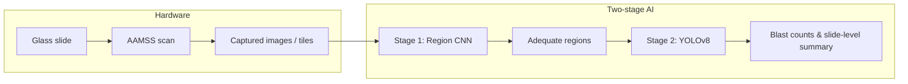

# ALLocate

**An AI-powered self-driving microscope for low-cost acute leukemia detection**

[](https://www.python.org/)
[]()

> ALLocate (**Acute Leukemia Locate**) couples a low-cost motorized microscope stage with a **two-stage** deep learning pipeline: a **CNN region classifier** (adequate vs. blood vs. clot) and a **YOLOv8** blast / non-blast detector. This repository will hold code, notebooks, hardware notes, and release artifacts for the accompanying manuscript.

---

## At a glance

| Component | Role |
|-----------|------|
| **AAMSS** (hardware) | Automated capture of marrow smears on a conventional microscope (~\$150 parts; not including microscope) |
| **Stage 1 — Region model** | Selects diagnostically adequate tiles before cell-level analysis |
| **Stage 2 — Detection model** | Localizes nucleated cells and classifies blasts vs. non-blasts |
| **End-to-end** | Tile → regions → detections → slide-level blast fraction vs. clinical thresholds |



---

## Repository layout *(skeleton — organize as code lands)*

```
ALLocate/
├── README.md                 ← you are here
├── docs/                     ← extended methods: hardware control architecture (TBD)
├── hardware_firmware/        ← Arduino / RAMPS firmware, wiring notes, BOM placeholders
├── region_classifier/      ← Stage 1: data prep, training, evaluation, inference
├── cell_detection/         ← Stage 2: data prep, training, evaluation, inference
├── pipeline/               ← End-to-end scripts: tile → region → detect → report
├── data/                   ← Data layout placeholders (no patient data in git)
├── notebooks/              ← Figure / plot reproduction for the paper
├── examples/               ← A small set of example images for documentation
├── weights/                ← Model checkpoints (release policy TBD)
└── region_cnn/             ← legacy / in-progress modules (to be merged by Ethan)
```

---

## Installation

> **TODO (Harry):** Add environment name, Python version, CUDA/CPU notes, and exact `pip` / `conda` commands once dependencies are pinned.

```bash
# Placeholder — replace with real instructions
python -m venv .venv
source .venv/bin/activate  # Windows: .venv\Scripts\activate
pip install -r requirements.txt
```

Optional: `requirements-train.txt`, `requirements-inference.txt`, or a `environment.yml` — *to be decided.*

---

## Data & cohorts *(high level)*

Training used de-identified whole-slide and tiled data from **UCSF**; external testing included **MSKCC** digitized slides and **glass-slide** evaluation via the self-driving microscope (**SDM**). **No restricted identifiers or raw clinical data should be committed to this repository.**

| Split / name | Purpose *(paper)* | Notes for this repo |
|--------------|-------------------|---------------------|
| TR / ER | Region classifier train / eval | Placeholder manifests under `data/` |
| TC / EC | Cell detector train / eval | Bounding-box format TBD in `cell_detection/` |
| EVC / EVS | External tile- and slide-level validation | External institution |
| SDM | Glass slides + AAMSS | Hardware + AI end-to-end |

**TODO:** Add `data/README.md` with directory conventions, filename patterns, and ethics / access language approved by the team.

---

## Stage 1 — Region classifier (CNN)

### Data collection *(placeholder)*

- Source: 40× / 400×-equivalent WSI-derived tiles; classes include **adequate**, **blood**, **clot**.
- **TODO:** Document tiling (e.g. libvips), label format, and train/val split policy.

### Training *(placeholder)*

- Framework: TensorFlow *(per manuscript)*; augmentations via Albumentations.
- **TODO:** Entry script, config files, and logging paths under `region_classifier/`.

### Inference *(placeholder)*

- Input: tiles or tiled WSI; output: class scores / masks / heatmaps for downstream region selection.
- **TODO:** CLI or Python API under `region_classifier/` and wiring in `pipeline/`.

---

## Stage 2 — Cell detection (YOLOv8)

### Data collection *(placeholder)*

- Annotated nucleated cells with bounding boxes; blast vs. non-blast (+ artifact class in training).
- **TODO:** Roboflow or local export format, class IDs, and QC steps documented in `cell_detection/`.

### Training *(placeholder)*

- Ultralytics YOLOv8; hyperparameter search summarized in supplementary tables in the paper.
- **TODO:** Train script, `data.yaml`, and experiment tracking location.

### Inference *(placeholder)*

- Input: regions passed from Stage 1; output: boxes, class labels, optional export for quantification.
- **TODO:** Batch vs. real-time inference, NMS settings, and blast fraction aggregation for slides.

---

## End-to-end pipeline

**TODO:** Describe how captured images or WSI tiles flow through Stage 1 → region selection (e.g. top-*k* adequate regions) → Stage 2 → **slide-level** blast percentage and comparison to clinical thresholds (e.g. ≤5% vs. ≥20%). Implementation will live under `pipeline/` with example configs.

---

## Hardware & stage control *(transparency)*

The manuscript describes a **RAMPS 1.4 + Arduino Mega 2560** setup, **NEMA 14** motors, and **3D-printed** couplings for X/Y stage actuation.

**Open item:** Final packaging for release — e.g. Arduino firmware, wiring diagram, mechanical BOM, and a short “control architecture” narrative may live under `hardware_firmware/` and `docs/`. *Decision pending.*

---

## Model weights

> **Release policy:** Whether **institutionally sensitive** fine-tuned weights can be distributed requires **Greg’s** input. Until then, this repo may ship a **public base architecture** or **sanitized checkpoint** under `weights/` with clear naming, e.g. `base/` vs. `allocate_full/` (placeholder).

**TODO:** Add checksums, license line per checkpoint, and inference-only vs. trainable flags.

---

## Examples

**TODO (Ethan):** Add **five** representative images (e.g. region classes, detection overlays, or glass-slide crops) under `examples/` with short captions in `examples/README.md`. *No PHI; de-identified or synthetic only.*

---

## Notebooks — figures & plots

**TODO (Ethan):** Curate notebooks under `notebooks/` that reproduce paper figures (ROC, PR, mAP, slide-level metrics, correlation plots, etc.), with pinned outputs or instructions to regenerate.

Suggested stubs:

- `notebooks/figures_region_classifier.ipynb`
- `notebooks/figures_cell_detection.ipynb`
- `notebooks/figures_slide_level.ipynb`

---

## Project checklist *(internal)*

- [ ] Draft README finalized *(this file — iterate)*  
- [ ] Folder structure agreed; **Ethan** reorganizes code into layout above  
- [ ] **Harry:** installation & dependency lockfiles  
- [ ] **Ethan:** five example images + notebook index for plots  
- [ ] **Greg:** decision on **official release** of sensitive model weights  
- [ ] Hardware / Arduino / control-architecture documentation approach decided  

---

## Citation

If you use this software or models, please cite the ALLocate manuscript *(details to add upon publication)*:

```bibtex
@article{allocate2025,
  title   = {An AI-Powered Self-Driving Microscope for Low-Cost Acute Leukemia Detection},
  author  = {Yan, Ethan and Sun, Shenghuan and others},
  journal = {TBD},
  year    = {2025},
  note    = {TODO: update with venue, volume, pages, DOI}
}
```

---

## Disclaimer

This repository supports **research and education**. It is **not** a medical device and is **not** intended for primary diagnosis. Clinical use requires appropriate validation, regulatory clearance where applicable, and qualified human oversight.

---

## Contact

**TODO:** Add correspondence email, issue tracker link, and institutional affiliation lines as appropriate.
